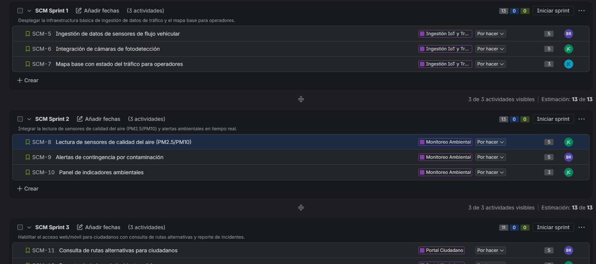
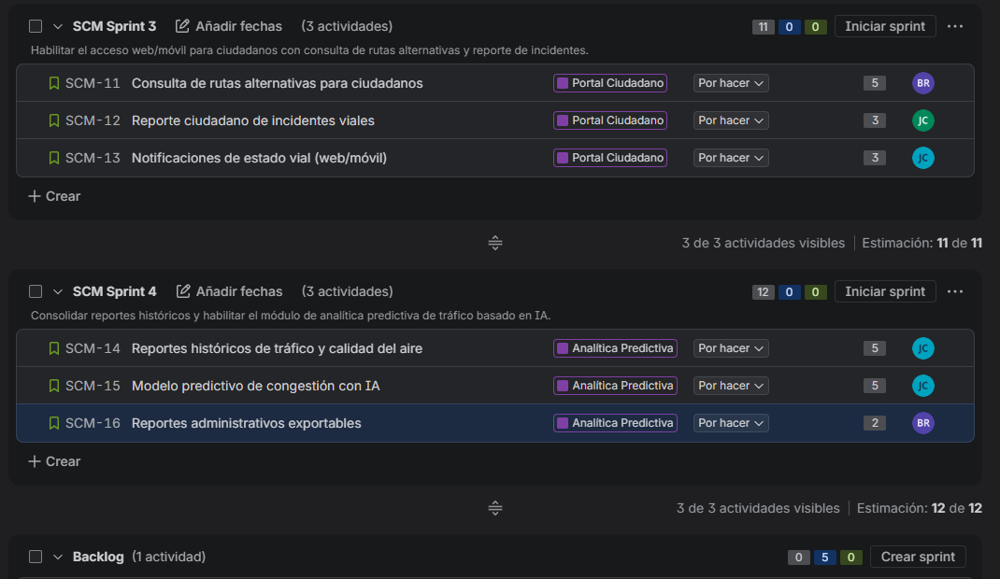
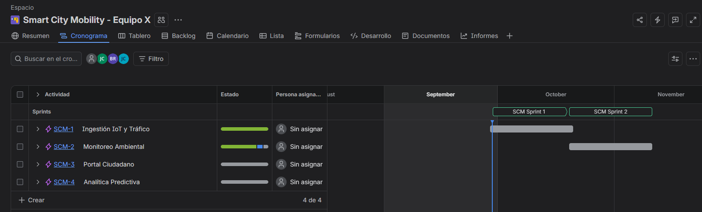
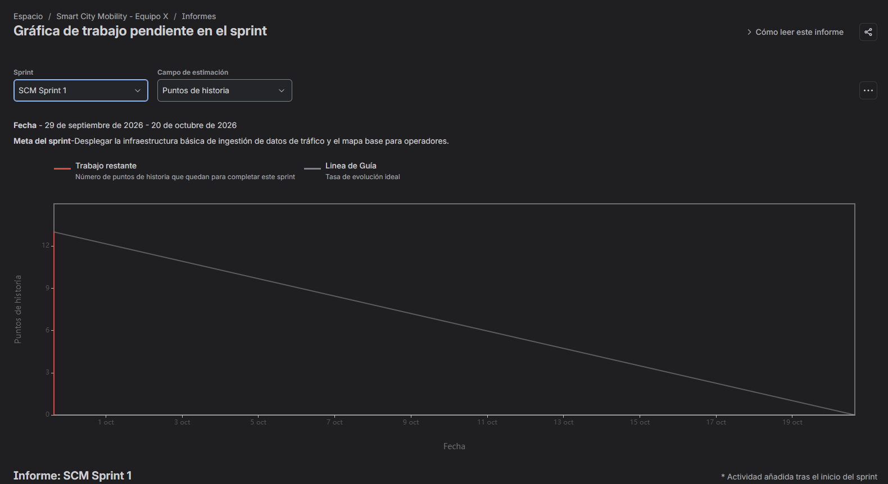
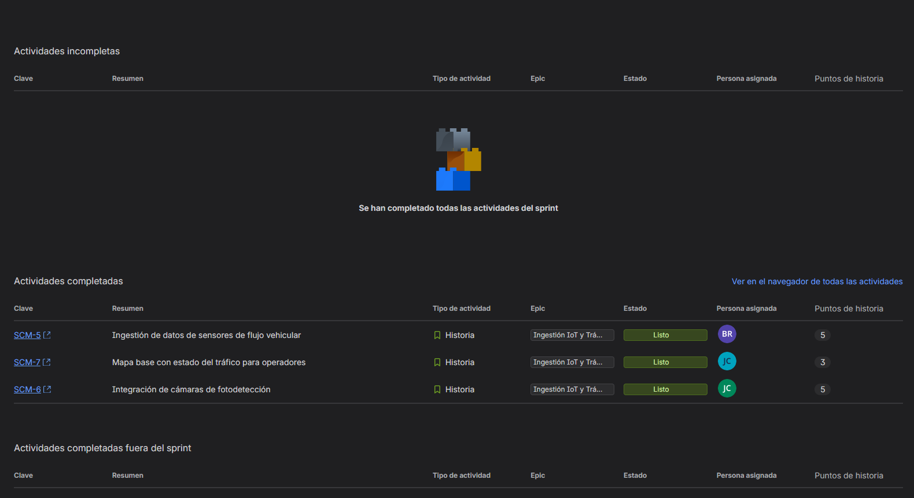
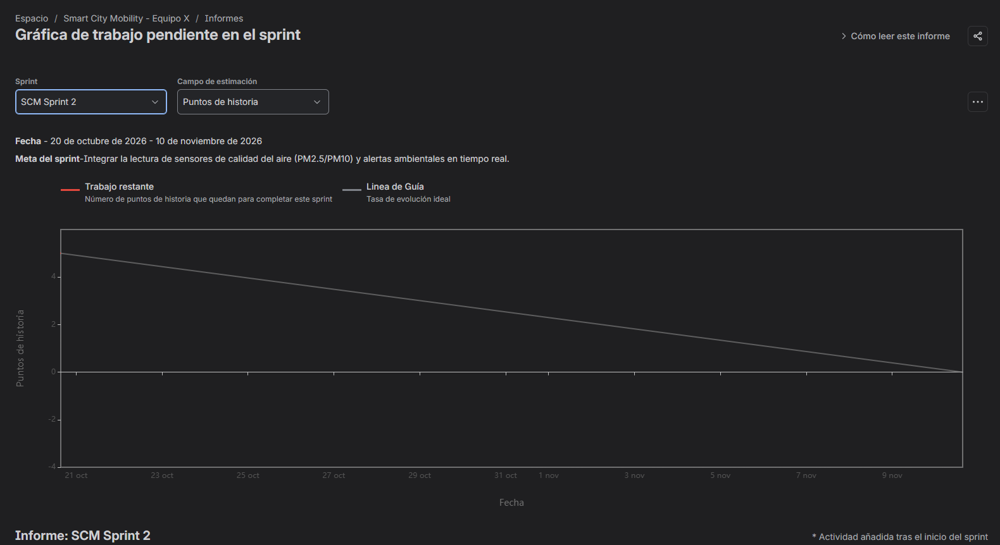
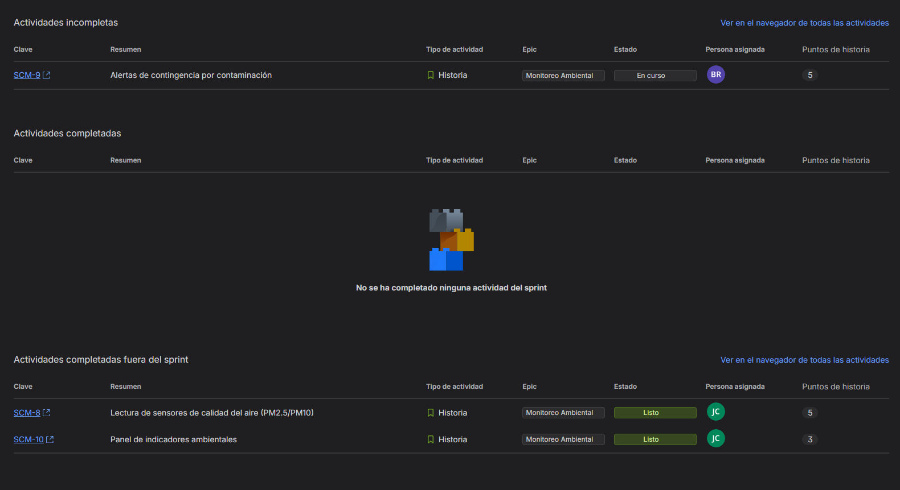
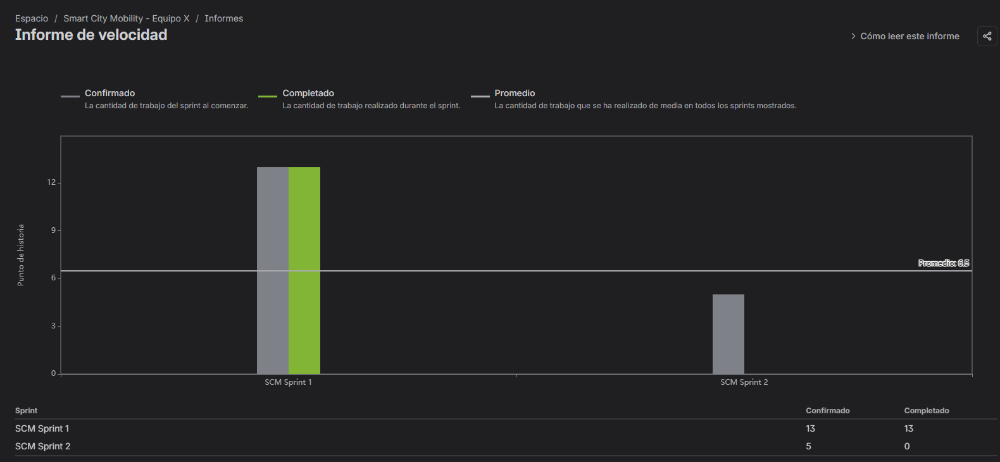

# Smart City Mobility: Plataforma Multimodal de Movilidad y Gestión Urbana

**Caso práctico de gestión ágil con Jira Software** · Ingeniería de Software II · Unidad Central del Valle del Cauca

Plataforma de gestión de tráfico e indicadores ambientales en tiempo real para una Secretaría de Movilidad Urbana. Integra datos de sensores IoT de flujo vehicular, estaciones de calidad del aire y cámaras de fotodetección para descongestionar avenidas, emitir alertas de contaminación y coordinar la atención de eventos en las vías.

## Tabla de contenido

1. [Acceso al proyecto en Jira](#1-acceso-al-proyecto-en-jira)
2. [Equipo](#2-equipo)
3. [Definition of Ready (DoR)](#3-definition-of-ready-dor)
4. [Definition of Done (DoD)](#4-definition-of-done-dod)
5. [Product Backlog](#5-product-backlog)
6. [Planificación multi-sprint](#6-planificación-multi-sprint)
7. [Simulación de avance y métricas](#7-simulación-de-avance-y-métricas)
8. [Descripción de las historias de usuario](#8-descripción-de-las-historias-de-usuario)

## 1. Acceso al proyecto en Jira

| Elemento | Detalle |
|---|---|
| Proyecto | Smart City Mobility - Equipo X |
| Clave | `SCM` |
| Tipo | Scrum, con estimación en Story Points |
| Enlace | [Abrir el proyecto en Jira](https://equipito65433.atlassian.net/jira/software/projects/SCM/boards/100/backlog) |

## 2. Equipo

Scrum Team autoorganizado de tres integrantes. El Product Owner y el Scrum Master también desarrollan, porque la guía contempla cuatro roles.

| Integrante | Rol | Historias asignadas | Puntos |
|---|---|---|---|
| Brahian Andrés Tenorio Reina | Product Owner y Developer | SCM-5, SCM-9, SCM-11, SCM-16 | 17 |
| Johan Eliu Salgado Castro | Scrum Master y Developer | SCM-6, SCM-8, SCM-10, SCM-12 | 16 |
| Jhon Alexis Gonzáles Cárdenas | Developer | SCM-7, SCM-13, SCM-14, SCM-15 | 16 |

**Docente:** Jairo Rodríguez Martínez

## 3. Definition of Ready (DoR)

**"Listo para desarrollar".** Una historia de usuario pasa del Backlog a un Sprint activo solo si cumple todo lo siguiente:

- [x] Está redactada con el formato **Como / Quiero / Para**.
- [x] Tiene criterios de aceptación en formato **Gherkin** (Dado / Cuando / Entonces).
- [x] Tiene **Story Points** asignados por consenso del equipo, con escala Fibonacci.
- [x] Está vinculada a una **Epic** en Jira.
- [x] Sus **dependencias técnicas** (datos de prueba, servicios externos, otras historias) están identificadas y resueltas.
- [x] Es lo bastante pequeña para completarse dentro de un solo Sprint.
- [x] El Product Owner la priorizó y el equipo la comprendió durante el refinamiento.

## 4. Definition of Done (DoD)

**"Terminado".** Una incidencia se mueve a *Done* en Jira solo si cumple todo lo siguiente:

- [x] El **Pull Request** fue revisado y aprobado por al menos un compañero.
- [x] La **cobertura de pruebas unitarias** es igual o superior al **80 %**.
- [x] Los criterios de aceptación fueron probados y validados en el ambiente de **staging**.
- [x] La **documentación de la API** está actualizada.
- [x] El código está integrado en la rama principal, sin defectos críticos abiertos.
- [x] Todas las subtareas de la historia están finalizadas.
- [x] El Product Owner validó la historia frente a sus criterios de aceptación.

## 5. Product Backlog

12 historias de usuario (tipo *Story*), estimadas en Story Points y agrupadas en 4 Epics. Total: **49 puntos**.

### Epics

| Clave | Epic | Historias |
|---|---|---|
| SCM-1 | Ingestión IoT y Tráfico | SCM-5, SCM-6, SCM-7 |
| SCM-2 | Monitoreo Ambiental | SCM-8, SCM-9, SCM-10 |
| SCM-3 | Portal Ciudadano | SCM-11, SCM-12, SCM-13 |
| SCM-4 | Analítica Predictiva | SCM-14, SCM-15, SCM-16 |

### Historias

| Clave | Historia | Epic | SP | Responsable | Sprint |
|---|---|---|---|---|---|
| SCM-5 | Ingestión de datos de sensores de flujo vehicular | Ingestión IoT y Tráfico | 5 | Brahian Tenorio | Sprint 1 |
| SCM-6 | Integración de cámaras de fotodetección | Ingestión IoT y Tráfico | 5 | Johan Salgado | Sprint 1 |
| SCM-7 | Mapa base con estado del tráfico para operadores | Ingestión IoT y Tráfico | 3 | Jhon Gonzáles | Sprint 1 |
| SCM-8 | Lectura de sensores de calidad del aire (PM2.5/PM10) | Monitoreo Ambiental | 5 | Johan Salgado | Sprint 2 |
| SCM-9 | Alertas de contingencia por contaminación | Monitoreo Ambiental | 5 | Brahian Tenorio | Sprint 2 |
| SCM-10 | Panel de indicadores ambientales | Monitoreo Ambiental | 3 | Johan Salgado | Sprint 2 |
| SCM-11 | Consulta de rutas alternativas para ciudadanos | Portal Ciudadano | 5 | Brahian Tenorio | Sprint 3 |
| SCM-12 | Reporte ciudadano de incidentes viales | Portal Ciudadano | 3 | Johan Salgado | Sprint 3 |
| SCM-13 | Notificaciones de estado vial (web/móvil) | Portal Ciudadano | 3 | Jhon Gonzáles | Sprint 3 |
| SCM-14 | Reportes históricos de tráfico y calidad del aire | Analítica Predictiva | 5 | Jhon Gonzáles | Sprint 4 |
| SCM-15 | Modelo predictivo de congestión con IA | Analítica Predictiva | 5 | Jhon Gonzáles | Sprint 4 |
| SCM-16 | Reportes administrativos exportables | Analítica Predictiva | 2 | Brahian Tenorio | Sprint 4 |

## 6. Planificación multi-sprint

4 sprints de 3 semanas (12 semanas en total), cada uno con su Sprint Goal configurado en Jira.

| Sprint | Duración | Sprint Goal | Historias | Story Points |
|---|---|---|---|---|
| Sprint 1 | 3 semanas | Desplegar la infraestructura básica de ingestión de datos de tráfico y el mapa base para operadores. | SCM-5, SCM-6, SCM-7 | 13 |
| Sprint 2 | 3 semanas | Integrar la lectura de sensores de calidad del aire (PM2.5/PM10) y alertas ambientales en tiempo real. | SCM-8, SCM-9, SCM-10 | 13 |
| Sprint 3 | 3 semanas | Habilitar el acceso web/móvil para ciudadanos con consulta de rutas alternativas y reporte de incidentes. | SCM-11, SCM-12, SCM-13 | 11 |
| Sprint 4 | 3 semanas | Consolidar reportes históricos y habilitar el módulo de analítica predictiva de tráfico basado en IA. | SCM-14, SCM-15, SCM-16 | 12 |
| **Total** | 12 semanas | | 12 historias | **49** |

## 7. Simulación de avance y métricas

### Simulación realizada

| Sprint | Comprometido | Completado | % avance | Observación |
|---|---|---|---|---|
| Sprint 1 | 13 pts | 13 pts | 100 % | SCM-5, SCM-6 y SCM-7 finalizadas aplicando la DoD. |
| Sprint 2 | 13 pts | 8 pts | ≈ 62 % | SCM-8 y SCM-10 finalizadas. SCM-9 (5 pts) quedó *En curso* por un bloqueo técnico simulado y volvió al Backlog. |
| Sprint 3 | 11 pts | - | - | Planificado, sin iniciar. |
| Sprint 4 | 12 pts | - | - | Planificado, sin iniciar. |

El 62 % del Sprint 2 (8 de 13 puntos) es lo más cercano al 66 % propuesto que permite el tamaño de las historias, porque solo se cierran historias completas.

### Sprint Burndown Chart: Sprint 1

### Sprint Burndown Chart: Sprint 2

### Velocity Chart

### Análisis de métricas y gráficos

**Velocity Chart y Burndown Chart.** En el Sprint 1 el equipo se comprometió con 13 puntos y completó 13 (100 %), lo que establece la velocidad de referencia. Su burndown muestra la línea ideal bajando de 13 a 0 durante las tres semanas planificadas (29 de septiembre al 20 de octubre de 2026), mientras que el trabajo restante real cayó a cero desde el inicio, porque las tres historias se cerraron de inmediato dentro de la simulación de laboratorio. En el Sprint 2 se planificaron 13 puntos y se entregaron 8 (≈ 62 %). Sin embargo, el Informe de velocidad de Jira lo registra con 5 puntos confirmados y 0 completados: SCM-8 y SCM-10 se finalizaron antes de la fecha de inicio que Jira asignó al sprint (20 de octubre al 10 de noviembre de 2026), por lo que el informe las clasifica como "completadas fuera del sprint" y solo SCM-9 aparece como trabajo comprometido. Por eso el promedio de 6,5 puntos de la gráfica subestima la capacidad real del equipo, y el estado verdadero se lee en la tabla del informe del sprint.

**Desvío del Sprint 2 y acciones correctivas.** El desvío simulado corresponde a SCM-9 (Alertas de contingencia por contaminación, 5 puntos), que quedó *En curso* por un bloqueo técnico: la calibración de los umbrales de PM2.5 depende de mediciones reales de SCM-8 y de la lógica que evita alertas duplicadas, dependencias que no estaban resueltas al iniciar el sprint. Para proteger los Sprints 3 y 4 el equipo adopta cinco acciones:

1. Ubicar SCM-9 al tope del Backlog priorizado e incorporarla al Sprint 3 solo si la velocidad observada lo permite, negociando con el Product Owner la salida de una historia de menor valor para no sobrecargar el sprint.
2. Reforzar la DoR exigiendo que las dependencias técnicas y los datos de prueba estén resueltos antes de comenzar.
3. Dividir las historias de 5 puntos en piezas más pequeñas durante el refinamiento.
4. Reservar cerca del 20 % de la capacidad para imprevistos.
5. Hacer seguimiento diario de bloqueos en la Daily Scrum y analizarlos en la Retrospectiva.

Con estas medidas, el Sprint 3 mantiene 11 puntos y el Sprint 4, 12 puntos, alineados con la velocidad demostrada por el equipo.

## 8. Descripción de las historias de usuario

<b>SCM-5: Ingestión de datos de sensores de flujo vehicular</b> (Ingestión IoT y Tráfico · 5 pts · Sprint 1)

**Como** operador de tráfico, **quiero** recibir en tiempo real los datos de los sensores IoT de flujo vehicular, **para** conocer el estado de las avenidas principales.

**Criterios de aceptación (Gherkin):**

- Dado que un sensor de flujo vehicular está activo, cuando envía una lectura, entonces el sistema la almacena en menos de 5 segundos.
- Dado que un sensor deja de reportar por más de 2 minutos, cuando el sistema lo detecta, entonces marca el sensor como "sin conexión" y notifica al operador.

<b>SCM-6: Integración de cámaras de fotodetección</b> (Ingestión IoT y Tráfico · 5 pts · Sprint 1)

**Como** operador de tráfico, **quiero** integrar las cámaras de fotodetección a la plataforma, **para** registrar eventos y contar vehículos en las vías.

**Criterios de aceptación (Gherkin):**

- Dado que una cámara está registrada en el sistema, cuando detecta un evento de tráfico, entonces se guarda el registro con fecha, hora y ubicación.
- Dado que la cámara pierde conexión, cuando pasa el tiempo de espera configurado, entonces el sistema genera una alerta técnica.

<b>SCM-7: Mapa base con estado del tráfico para operadores</b> (Ingestión IoT y Tráfico · 3 pts · Sprint 1)

**Como** operador de tráfico, **quiero** ver un mapa con el estado del tráfico por colores, **para** identificar rápidamente las zonas congestionadas.

**Criterios de aceptación (Gherkin):**

- Dado que el operador inicia sesión, cuando abre el mapa, entonces ve las avenidas principales con su nivel de flujo (fluido, moderado, congestionado).
- Dado que llegan nuevos datos de sensores, cuando se actualizan, entonces el mapa refleja el cambio sin recargar la página.

<b>SCM-8: Lectura de sensores de calidad del aire (PM2.5/PM10)</b> (Monitoreo Ambiental · 5 pts · Sprint 2)

**Como** analista ambiental, **quiero** recibir las mediciones de PM2.5 y PM10 de las estaciones de monitoreo, **para** conocer la calidad del aire en tiempo real.

**Criterios de aceptación (Gherkin):**

- Dado que una estación de monitoreo está activa, cuando envía una medición, entonces el sistema registra los valores de PM2.5 y PM10 con su marca de tiempo.
- Dado que llega un valor fuera del rango físico posible, cuando el sistema lo valida, entonces lo descarta y registra el error.

<b>SCM-9: Alertas de contingencia por contaminación</b> (Monitoreo Ambiental · 5 pts · Sprint 2)

**Como** secretario de movilidad, **quiero** recibir alertas automáticas cuando la contaminación supere los umbrales, **para** activar medidas de contingencia oportunamente.

**Criterios de aceptación (Gherkin):**

- Dado que se define un umbral máximo de PM2.5, cuando una medición lo supera, entonces el sistema envía una alerta a los usuarios responsables.
- Dado que la alerta ya fue enviada, cuando el valor sigue por encima del umbral, entonces no se duplica la notificación durante 30 minutos.

<b>SCM-10: Panel de indicadores ambientales</b> (Monitoreo Ambiental · 3 pts · Sprint 2)

**Como** analista ambiental, **quiero** un panel con indicadores de calidad del aire por zona, **para** hacer seguimiento a las tendencias de contaminación.

**Criterios de aceptación (Gherkin):**

- Dado que el analista abre el panel, cuando selecciona una zona, entonces ve los valores actuales y el promedio de las últimas 24 horas.
- Dado que existen datos históricos, cuando cambia el rango de fechas, entonces los gráficos se actualizan con ese periodo.

<b>SCM-11: Consulta de rutas alternativas para ciudadanos</b> (Portal Ciudadano · 5 pts · Sprint 3)

**Como** ciudadano, **quiero** consultar rutas alternativas según el estado del tráfico, **para** llegar a mi destino evitando las vías congestionadas.

**Criterios de aceptación (Gherkin):**

- Dado que el ciudadano ingresa origen y destino, cuando solicita la ruta, entonces el sistema muestra al menos 2 opciones con su tiempo estimado.
- Dado que una vía está congestionada, cuando se calcula la ruta, entonces esa vía se evita o se penaliza en las sugerencias.

<b>SCM-12: Reporte ciudadano de incidentes viales</b> (Portal Ciudadano · 3 pts · Sprint 3)

**Como** ciudadano, **quiero** reportar incidentes como accidentes o daños en la vía, **para** que las autoridades los atiendan rápidamente.

**Criterios de aceptación (Gherkin):**

- Dado que el ciudadano completa el formulario con tipo, ubicación y descripción, cuando lo envía, entonces el sistema registra el reporte y muestra un número de seguimiento.
- Dado que faltan datos obligatorios, cuando intenta enviar, entonces el sistema muestra un mensaje de error indicando qué campo falta.

<b>SCM-13: Notificaciones de estado vial (web/móvil)</b> (Portal Ciudadano · 3 pts · Sprint 3)

**Como** ciudadano, **quiero** recibir notificaciones sobre cierres y congestiones en mis rutas frecuentes, **para** planear mis desplazamientos con anticipación.

**Criterios de aceptación (Gherkin):**

- Dado que el ciudadano guardó una ruta frecuente y activó las notificaciones, cuando ocurre un incidente en ella, entonces recibe un aviso en la web o el móvil.
- Dado que el ciudadano desactiva las notificaciones, cuando ocurre un incidente, entonces no recibe ningún aviso.

<b>SCM-14: Reportes históricos de tráfico y calidad del aire</b> (Analítica Predictiva · 5 pts · Sprint 4)

**Como** secretario de movilidad, **quiero** consultar reportes históricos de tráfico y calidad del aire, **para** tomar decisiones basadas en datos.

**Criterios de aceptación (Gherkin):**

- Dado que existen datos almacenados, cuando el usuario selecciona un rango de fechas y una zona, entonces el sistema genera el reporte con tablas y gráficos.
- Dado que no hay datos en el rango elegido, cuando se solicita el reporte, entonces el sistema informa que no hay información disponible.

<b>SCM-15: Modelo predictivo de congestión con IA</b> (Analítica Predictiva · 5 pts · Sprint 4)

**Como** planificador de movilidad, **quiero** un modelo que prediga la congestión en las avenidas principales, **para** anticipar medidas de descongestión.

**Criterios de aceptación (Gherkin):**

- Dado que el modelo fue entrenado con datos históricos, cuando se solicita una predicción para la próxima hora, entonces el sistema muestra el nivel de congestión esperado por avenida.
- Dado que se evalúa el modelo con datos de prueba, cuando se mide su precisión, entonces esta es igual o superior al umbral acordado por el equipo.

<b>SCM-16: Reportes administrativos exportables</b> (Analítica Predictiva · 2 pts · Sprint 4)

**Como** administrador de la secretaría, **quiero** exportar los reportes a PDF y Excel, **para** compartirlos con otras dependencias.

**Criterios de aceptación (Gherkin):**

- Dado que se generó un reporte, cuando el administrador elige "Exportar", entonces puede descargarlo en PDF o Excel.
- Dado que el archivo se descarga, cuando se abre, entonces contiene los mismos datos y filtros que se veían en pantalla.

